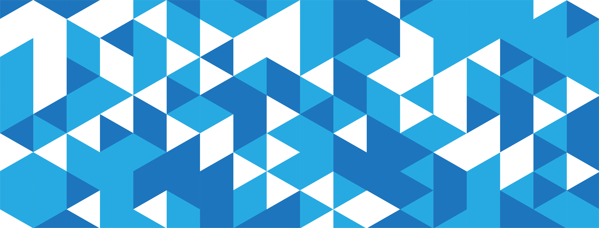

  

 

# Terbuka. Kolaboratif. Berbasis Data.

**Datasea Labs** (Divisi MIDTECH) memberdayakan mahasiswa, peneliti, dan pengembang untuk membawa teknologi dan semangat komunitas ke dalam dunia Data Science. Kami percaya pada kekuatan pendidikan terbuka dan riset yang transparan.

---

### 🚀 Mari Berkontribusi

Saat ini, komunitas kami sedang membangun berbagai proyek data yang menarik. Baik Anda seorang mahasiswa, mentor, atau sekadar penasaran, berikut cara untuk terlibat:

* **Jelajahi Riset**: Pelajari proyek kami yang sudah tersedia mencakup topik Perumahan, Kesehatan, hingga Analisis Spotify.
* **Ikuti Bootcamp**: Dapatkan informasi tentang program Data Science "Academy" kami.
* **Berkontribusi**: Kami menerima *issues* dan *pull requests* pada dataset publik kami.
* **Bertanya**: Gunakan tab **Issue** untuk mendiskusikan temuan atau metodologi tertentu pada di repositori tertuju.

---

### 🔭 Riset Unggulan (2025)

Berikut adalah repositori aktif dari kohort (angkatan) terbaru kami:

| Topik Riset | Repository Link | Sumber Dataset | Status |
| :--- | :--- | :--- | :--- |
| **📈 Sales Data Analysis** | [sales-forecasting-time-series](https://github.com/Datasea-Labs/sales-forecasting-time-series) | Data Ritel |  |
| **❤️ Heart Disease Analysis** | [heart-disease-analysis](https://github.com/Datasea-Labs/heart-disease-analysis) | Data Kesehatan |  |
| **🏠 House Prices Analysis** | [house-prices-analysis](https://github.com/Datasea-Labs/house-prices-analysis) | Real Estate |  |
| **🎵 Spotify 2023 Analysis** | [spotify-songs-analysis](https://github.com/Datasea-Labs/spotify-songs-analysis) | Spotify Charts |  |
| **👥 HR Employee Attrition** | [hr-employee-attrition-analysis](https://github.com/Datasea-Labs/hr-employee-attrition-analysis) | Data HR IBM |  |

---

### 🤝 Kode Etik (Code of Conduct)

Proyek Datasea mengadopsi **Open Source Code of Conduct**. Kami berkomitmen untuk menyediakan lingkungan yang ramah, aman, dan terbuka bagi semua orang, terlepas dari tingkat pengalaman, latar belakang, identitas, maupun karakteristik lainnya.

Untuk informasi lebih lanjut, silakan lihat [Panduan Komunitas](https://github.com/datasea-dev) kami.

 

  Dikelola dengan ❤️ oleh Tim MIDTECH

